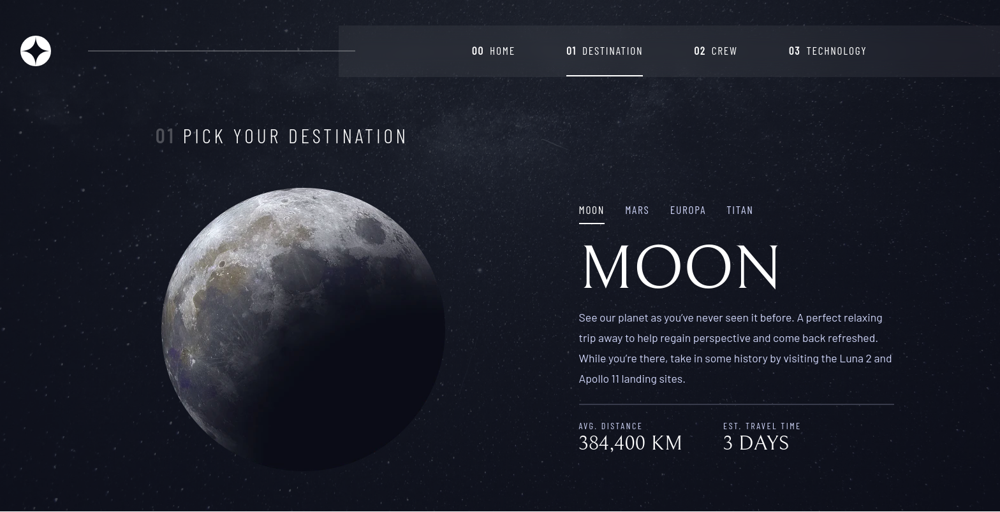

# Frontend Mentor - Space tourism website solution

This is a solution to the [Space tourism website challenge on Frontend Mentor](https://www.frontendmentor.io/challenges/space-tourism-multipage-website-gRWj1URZ3). Frontend Mentor challenges help you improve your coding skills by building realistic projects.

## Table of contents

- [Frontend Mentor - Space tourism website solution](#frontend-mentor---space-tourism-website-solution)
  - [Table of contents](#table-of-contents)
  - [Overview](#overview)
    - [The challenge](#the-challenge)
    - [Screenshot](#screenshot)
    - [Links](#links)
  - [Built with](#built-with)
  - [Author](#author)

## Overview

### The challenge

Users should be able to:

- View the optimal layout for each of the website's pages depending on their device's screen size
- See hover states for all interactive elements on the page
- View each page and be able to toggle between the tabs to see new information

### Screenshot

### Links

- Solution URL: [solution](https://www.frontendmentor.io/solutions/space-tourism-with-react-and-typescript-responsive-layout-WDD3aGX1jI)
- Live Site URL: [live site](https://space-tourism-aka.vercel.app/)

## Built with

- Semantic HTML5 markup (JSX)
- Flexbox
- Mobile-first workflow
- [React](https://reactjs.org/) - JS library
- [TypeScript](https://www.typescriptlang.org/) - Language
- [Styled Components](https://styled-components.com/) - For styles
- [React Router Dom](https://reactrouter.com/en/main) - Routes and Navigation
- [React Responsive](https://www.npmjs.com/package/react-responsive) - Responsive Layout
## Author

  

  Frontend Mentor - [@CauaRodrigues](https://www.frontendmentor.io/profile/CauaRodrigues)

  LikedIn - [Cauã Rodrigues](https://www.linkedin.com/in/cauaassis/)

